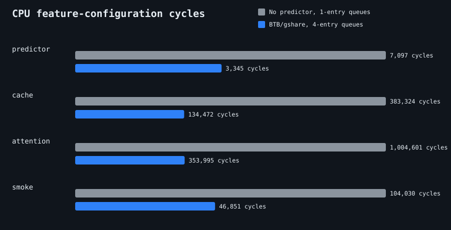
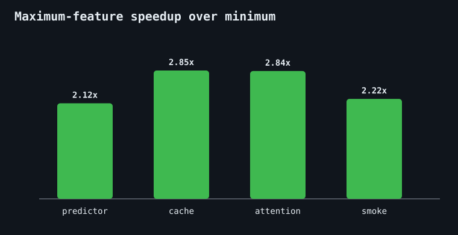

# Pipelined RV32I RISC-V CPU

This repository contains a five-stage RV32I CPU with synchronous instruction,
data, and register-file interfaces. It supports the Zmmul subset, data-hazard
bypassing, load-use stalls, control-flow prediction, and Verilator execution of
linked C programs.

## Predictor timing

The target and direction predictors are deliberately separate:

- A 32-entry direct-mapped BTB is indexed by the fetch PC. Every hit predicts a
  transfer to its cached target during fetch.
- A 64-entry gshare table with six history bits is indexed in decode. For a
  conditional branch, it either confirms the BTB-taken path or redirects to the
  fall-through path.
- Execute resolves the branch, updates the BTB and the saved gshare counter
  index, and performs authoritative recovery on a mismatch.

## Decoupled cache issue

The frontend has a four-entry ordered fetch window. It submits a new request on
every cycle that `bsg_cache` accepts one, saves the PC and BTB prediction with
that request, and fills the corresponding entry when the ordered response
returns. Decode consumes completed entries independently. Branch recovery bumps
an epoch and discards stale responses without draining the cache pipeline first.

The data side has a four-entry ordered store queue. A store retires after its
address, data, and byte mask enter the queue; queued stores can then issue to the
BSG D-cache on consecutive cycles. Loads conservatively wait for all older
stores to receive cache responses, preserving program order without requiring
store-to-load forwarding.

## Multiply

`MUL`, `MULH`, `MULHSU`, and `MULHU` share a one-cycle registered BaseJump STL
radix-4 Booth multiplier. Execute holds the multiply instruction for the
registered cycle, then forwards its result normally. `MULHSU` uses an unsigned
product with the standard signed-left-operand high-word correction.

## Simulation and benchmarks

The default simulation environment uses Verilator and the RV32 Zmmul GNU
toolchain configured in `Sim/site-config.sh`.

```sh
make predictor-test
make cache-test
make attention
```

The directed regressions cover all four multiply results, predictable branch
traffic, and dirty evictions from a working set twice the D-cache capacity. The
deterministic 16x16 integer attention benchmark checks its input,
projection, Q/K/V, score, probability, and output tensor hashes against the
accelerator reference. MMIO markers delimit kernel-only cycle, retired
instruction, branch, and misprediction counters.

## Feature-sweep results

The reproducible feature sweep compares two configurations while holding the
RV32I/Zmmul datapath and 8 KiB two-way BSG caches constant:

- **Minimum:** branch prediction disabled; one-entry fetch window, store queue,
  and cache metadata queue.
- **Maximum:** BTB/gshare prediction enabled; four-entry fetch window, store
  queue, and cache metadata queue.

Results below were collected with Verilator on 2026-08-10. Speedup is minimum
cycles divided by maximum cycles, so values above 1 favor the maximum
configuration.

| Workload | Minimum cycles | Maximum cycles | Speedup | Minimum CPI | Maximum CPI |
|---|---:|---:|---:|---:|---:|
| Predictor/Zmmul | 7,097 | 3,345 | 2.12x | 4.88 | 2.30 |
| Dirty-cache stress | 383,324 | 134,472 | 2.85x | 4.68 | 1.64 |
| 16x16 attention | 1,004,601 | 353,995 | 2.84x | 4.70 | 1.66 |
| libmc smoke | 104,030 | 46,851 | 2.22x | 4.98 | 2.24 |

For the marked attention kernel alone, cycles fall from 812,098 to 290,310, a
2.80x speedup. The attention outputs are bit-identical in both runs. The largest
gains come from overlapping BSG hit latency and allowing store-heavy loops to
continue until the ordered store queue fills. Prediction also reduces attention
control recoveries from 25,154 to 4,156 inside the marked kernel.





Raw counters are saved in
[`benchmarks/results/feature_sweep.csv`](benchmarks/results/feature_sweep.csv),
with one log per run in the same directory. Regenerate the data and charts with:

```sh
make feature-bench
```

Both L1s are 8 KiB, two-way, write-back BaseJump STL `bsg_cache` instances with
32-byte lines. A four-entry metadata adapter preserves ordered CPU responses,
while a blocking line-DMA bridge converts refills and evictions to the
simulation memory's 32-bit transactions. The MMIO window at `0x0002fff0` is
uncached.

## Sky130 PPA

```sh
make ppa
```

This uses the OSS CAD Suite for synthesis and the OpenLane2 Nix environment for
OpenROAD timing and vectorless power. See `asic/README.md` for the synthesis
boundary and assumptions.
